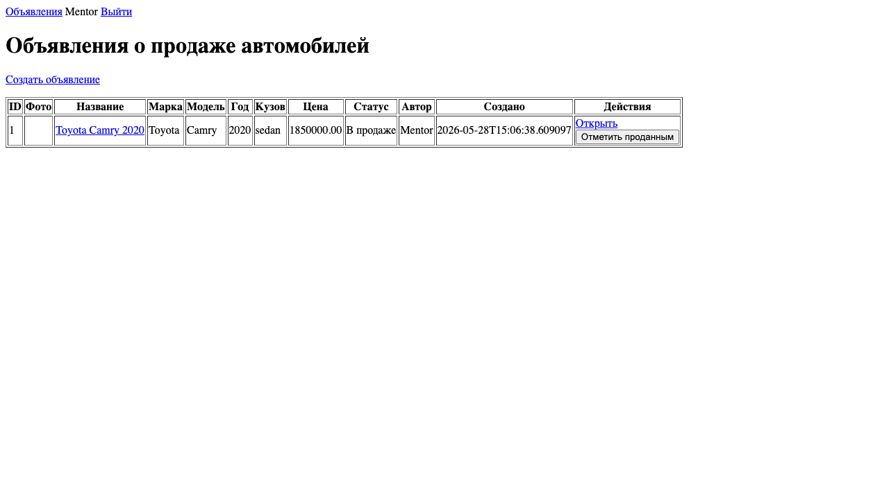
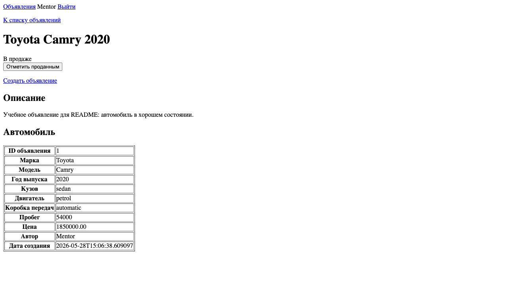

# job4j_cars

Учебное web-приложение для размещения объявлений о продаже автомобилей.
Проект реализован в стиле курса job4j Web: Spring Boot, Thymeleaf и Hibernate без Spring Data.

## Возможности

- просмотр списка объявлений о продаже автомобилей;
- просмотр детальной страницы объявления;
- регистрация, вход и выход пользователя;
- создание объявления авторизованным пользователем;
- заполнение характеристик автомобиля: марка, модель, год выпуска, кузов, двигатель, коробка передач, пробег;
- загрузка фотографии автомобиля;
- отображение статуса объявления: в продаже или продан;
- изменение статуса объявления только автором.

## Технологии

- Java 17;
- Maven;
- Spring Boot;
- Thymeleaf;
- Hibernate ORM;
- Liquibase;
- PostgreSQL для запуска приложения;
- H2 для тестов.

## Архитектура

Приложение разделено на три слоя:

- `controller` — HTTP-запросы, сессия пользователя, формы и подготовка данных для Thymeleaf;
- `service` — бизнес-правила: регистрация, вход, создание объявления, проверка автора при смене статуса;
- `repository` — работа с базой данных через Hibernate.

Spring Data в проекте не используется. В проекте нет `JpaRepository`, `CrudRepository` и derived query methods.
Hibernate `SessionFactory` создается как Spring bean в `HibernateConfig` и внедряется в репозитории через конструктор.

Основные классы:

- `User`, `Car`, `Post` — модели домена;
- `UserRepository`, `CarRepository`, `PostRepository` — Hibernate-репозитории;
- `UserService`, `CarService`, `PostService` — сервисный слой;
- `UserController`, `PostController` — web-слой.

Фотографии объявлений сохраняются в локальную директорию `uploads/`. Эта директория исключена из Git, чтобы не коммитить пользовательские файлы.

Для учебного проекта пароль пользователя хранится в открытом виде. TODO: заменить на хеширование паролей, если это потребуется отдельной задачей.

## Запуск

Требования:

- JDK 17;
- Maven;
- PostgreSQL.

Создайте базу данных:

```bash
createdb -U postgres job4j_cars
```

Если команда `createdb` недоступна, можно создать базу через `psql`:

```bash
psql -U postgres -c "CREATE DATABASE job4j_cars;"
```

По умолчанию приложение подключается к PostgreSQL со следующими параметрами:

```text
JDBC URL: jdbc:postgresql://127.0.0.1:5432/job4j_cars
User Name: postgres
Password: password
```

Если у вас другие параметры подключения, измените их в двух файлах:

- `src/main/resources/application.properties`;
- `src/main/resources/hibernate.cfg.xml`.

Запустите приложение:

```bash
mvn spring-boot:run
```

После запуска приложение доступно по адресам:

```text
http://localhost:8080/
http://localhost:8080/posts
```

Если порт `8080` занят, можно указать другой порт:

```bash
mvn spring-boot:run -Dspring-boot.run.arguments=--server.port=8081
```

## Миграции базы данных

Миграции выполняются Liquibase автоматически при старте приложения.

Главный changelog:

```text
db/dbchangelog.xml
```

SQL-скрипты:

```text
db/scripts/001_ddl_create_users_table.sql
db/scripts/002_ddl_create_cars_table.sql
db/scripts/003_ddl_create_posts_table.sql
```

## Проверка

```bash
mvn test
```

## Скриншоты

### Список объявлений



### Создание объявления


### Детальная страница объявления



### Вход пользователя


